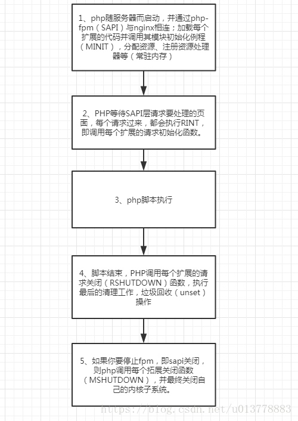

# PHP
### 面试题

#### 声明一个变量占几个字节
16个字节

#### php是怎么实现弱类型
zval_struct中的zval_value底层会声明联合体（字符串、bool、int强类型声明）

#### zend string写时复制
当一个变量赋值给另一个变量时，不会直接在存储中复制一份，只会新增一个引用，指向变量的地址空间；当变量发生变更时，才会在存储中复制一份新的。
优点：这样能够节省空间，避免空间的浪费。

#### php垃圾回收机制
##### 变量在zval的变量容器中结构

> zval中，除了存储变量的类型和值之外，还有is_ref字段和refcount字段
>     1、is_ref：是个bool值，用来区分变量是否属于引用集合。
>     2、refcount：计数器，表示指向这个zval变量容器的变量个数。
 
##### 垃圾回收算法（根缓存区满时）
1. 对每个根缓冲区中的根zval按照深度优先遍历算法遍历所有能遍历到的zval，并将每个zval的refcount减1，同时为了避免对同一zval多次减1(因为可能不同的根能遍历到同一个zval)，每次对某个zval减1后就对其标记为“已减”。
2. 再次对每个缓冲区中的根zval深度优先遍历，如果某个zval的refcount不为0，则对其加1，否则保持其为0。
3. 清空根缓冲区中的所有根(注意是把这些zval从缓冲区中清除而不是销毁它们)，然后销毁所有refcount为0的zval，并收回其内存。

### php底层数组
php解决哈希冲突的方式是使用了链接法，所以php数组是由哈希表+链表实现，准确来说，是由哈希表+双向链表实现
#### 内部结构-哈希表
HashTable结构体主要用来存放哈希表的基本信息

```
typedef struct _hashtable { 
    uint nTableSize;        // hash Bucket的大小，即哈希表的容量，最小为8，以2x增长。
    uint nTableMask;        // nTableSize-1 ， 索引取值的优化
    uint nNumOfElements;    // hash Bucket中当前存在的元素个数，count()函数会直接返回此值 
    ulong nNextFreeElement; // 下一个可使用的数字键值
    Bucket *pInternalPointer;   // 当前遍历的指针（foreach比for快的原因之一）
    Bucket *pListHead;          // 存储整个哈希表的头元素指针
    Bucket *pListTail;          // 存储整个哈希表的尾元素指针
    Bucket **arBuckets;         // 存储hash数组
    dtor_func_t pDestructor;    // 在删除元素时执行的回调函数，用于资源的释放
    zend_bool persistent;       //指出了Bucket内存分配的方式。如果persisient为TRUE，则使用操作系统本身的内存分配函数为Bucket分配内存，否则使用PHP的内存分配函数。
    unsigned char nApplyCount; // 标记当前hash Bucket被递归访问的次数（防止多次递归）
    zend_bool bApplyProtection;// 标记当前hash桶允许不允许多次访问，不允许时，最多只能递归3次
#if ZEND_DEBUG
    int inconsistent;
#endif
} HashTable;
```
Bucket结构体则用于保存数据的具体内容

```
typedef struct bucket {
    ulong h;            // 对char *key进行hash后的值，或者是用户指定的数字索引值
    uint nKeyLength;    // hash关键字的长度，如果数组索引为数字，此值为0
    void *pData;        // 指向value，一般是用户数据的副本，如果是指针数据，则指向pDataPtr
    void *pDataPtr;     // 如果是指针数据，此值会指向真正的value，同时上面pData会指向此值
    struct bucket *pListNext;   // 指向整个哈希表的该单元的下一个元素
    struct bucket *pListLast;   // 指向整个哈希表的该单元的上一个元素
    struct bucket *pNext;       // 指向由于哈希冲突导致存放在同一个单元的链表中的下一个元素
    struct bucket *pLast;       // 指向由于哈希冲突导致存放在同一个单元的链表中的上一个元素
    // 保存当前值所对于的key字符串，这个字段只能定义在最后，实现变长结构体
    char arKey[1];              
} Bucket;
```

### PHP-FPM
#### CGI协议
为了解决不同的语言解释器(如php、python解释器)与webserver的通信，于是出现了cgi协议。只要你按照cgi协议去编写程序，就能实现语言解释器与webwerver的通信。如php-cgi程序。
缺点：每来一个请求都要去fork一个进程处理，浪费资源
#### fast-cgi协议
出现了cgi的改良版本，fast-cgi。fast-cgi每次处理完请求后，不会kill掉这个进程，而是保留这个进程，使这个进程可以一次处理多个请求。这样每次就不用重新fork一个进程了，大大提高了效率。

#### FPM是什么
php-fpm即php-Fastcgi Process Manager.
php-fpm是 FastCGI 的实现，并提供了进程管理的功能。
进程包含 master 进程和 worker 进程两种进程。
master 进程只有一个，负责监听端口，接收来自 Web Server 的请求，而 worker 进程则一般有多个(具体数量根据实际需要配置)，每个进程内部都嵌入了一个 PHP 解释器，是 PHP 代码真正执行的地方。

> master进程进行强制kill掉，worker进程能不能继续服务？
> kill -9 （master来不及通知worker进程挂掉） worker进程能够正常提供服务
> kill 会通知worker进程挂掉 worker进程不能提供服务

### PHP-FPM 三种模式
1. pm=static

静态。始终保持一个固定数量的子进程，这个数由（pm.max_childrem）定义，这种方式很不灵活，通常不是默认的

2. pm=dynamic

动态。子进程的数量在下面配置的基础上动态设置：pm.max_children、pm.start_servers、pm.min_spare_servers、pm.max_spare_servers。

启动时，会创建固定数量的子进程（由pm.start_servers控制）可以理解成最小子进程树，而最大子进程数由pm.max_childrem参数控制，这样的话子进程数在会在最大和最小区间变化。

闲置的子进程由另外2个配置控制，分别是pm.min_spare_servers和pm.max_spare_servers，也就是闲置的子进程也有最大和最小数量限制，而如果闲置的子进程超出pm.max_spare_servers则会被杀掉。

这种模式非常灵活，也通常是默认选项。但是，dynamic模式为了最大化的优化服务器响应，会造成更多内存使用，因为这种模式只会杀掉最大闲置进程数（pm.max_spare_servers）的闲置进程，比如最大闲置进程是30，最大进程是50，然后网站经历一个访问高峰，此时50个子进程全部忙碌，0个闲置进程，然后过了高峰期，可能没有一个请求，于是可能由50个闲置进程，但是此时PHP-FPM会杀掉20个子进程，始终剩下30个闲置进程等待请求，这可能就是为什么过了高峰期后即便请求书大量减少服务器内存使用却没有大量减少，也可能是为什么有些时候重启服务器会好些，因为重启后，PHP-FPM子进程数会变成最小闲置进程数，而不是之前最大闲置进程数。

3. pm=ondemand

进程有需要时才产生，由dynamic相反，pm=start_servers在服务启动时即启动。

这种模式把内存放到第一位，它的工作模式很简单，每个闲置进程在持续闲置了pm.process_idle_timeout秒后就会被杀掉，有了这个模式，到了服务器低峰期内存会自动降下来，如果服务器长时间没有请求，就只有一个PHP-FPM主进程，当然弊端是，遇到高峰期或者如果pm.process_idle_timeout的值太短的话，无法避免服务器重复创建进程的问题，因此pm=dynamic和pm=ondemand谁更合适视情况而定。

#### PHP-FPM 生命周期
以nginx服务器为例，在web模式下，生命周期流程如下


SAPI运行PHP都经过下面几个阶段:
1、模块初始化阶段（module init）：
这个阶段主要进行php框架、zend引擎的初始化操作。这个阶段一般是在SAPI启动时执行一次，对于FPM而言，就是在fpm的master进行启动时执行的。php加载每个扩展的代码并调用其模块初始化例程（MINIT），进行一些模块所需变量的申请,内存分配等。

2、请求初始化阶段（request init）：
当一个页面请求发生时，在请求处理前都会经历的一个阶段。对于fpm而言，是在worker进程accept一个请求并读取、解析完请求数据后的一个阶段。在这个阶段内，SAPI层将控制权交给PHP层，PHP初始化本次请求执行脚本所需的环境变量。

3、php脚本执行阶段
php代码解析执行的过程。Zend引擎接管控制权，将php脚本代码编译成opcodes并顺次执行

4、请求结束阶段（request shutdown）：
请求处理完后就进入了结束阶段，PHP就会启动清理程序。这个阶段，将flush输出内容、发送http响应内容等，然后它会按顺序调用各个模块的RSHUTDOWN方法。 RSHUTDOWN用以清除程序运行时产生的符号表，也就是对每个变量调用unset函数。

5、模块关闭阶段（module shutdown）：
该阶段在SAPI关闭时执行，与模块初始化阶段对应，这个阶段主要是进行资源的清理、php各模块的关闭操作，同时，将回调各扩展的module shutdown钩子函数。这是发生在所有请求都已经结束之后，例如关闭fpm的操作。（这个是对于CGI和CLI等SAPI，没有“下一个请求”，所以SAPI立刻开始关闭。）
 

