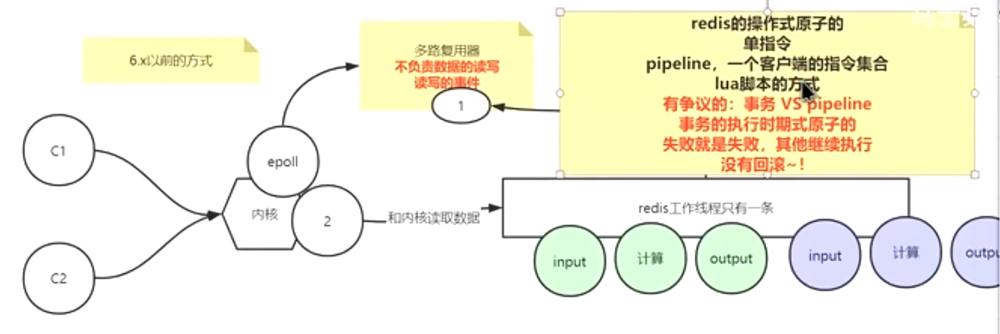
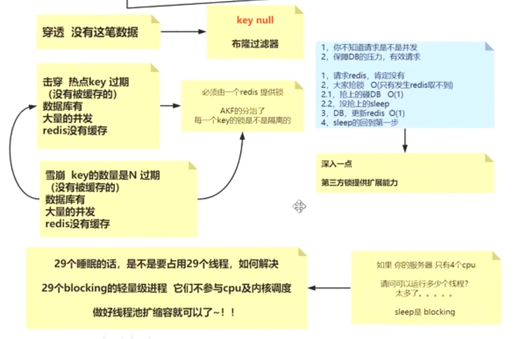
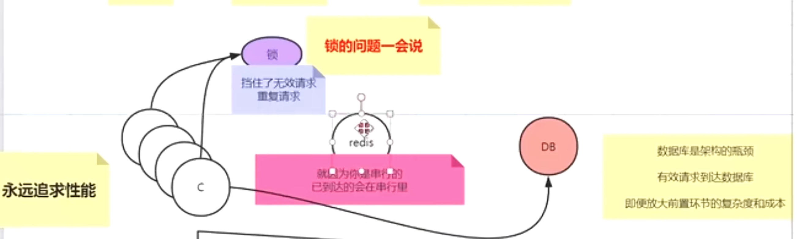

### 应用场景
1. 缓存（数据缓存、会话缓存、全页面缓存（FPC））
2. 计数器
3. 查找表
4. 消息队列（List）
5. 分布式锁

### redis是单线程还是多线程
1. 无论什么版本，工作线程就是一个
2. 6.x高版本出现了IO多线程
3. 单线程，满足redis的串行原子性，只不过IO多线程，把输入、输出放到更多的线程去并行，好处如下：执行时间缩短，更快；
4. redis利用队列技术将并发访问变为串行访问，消除了传统数据库串行控制的开销

#### 6.x之前的方式

#### 6.x之后的方式

### Redis单线程为什么这么快？
1. 纯内存操作
2. 核心是基于非阻塞的IO多路复用机制
3. 单线程避免了多线程的频繁上下文切换带来的性能问题。

### Redis存在线程安全的问题吗？ 为什么
redis可以保障内部串行
外界使用的时候要保障，业务上要自行保障顺序~

### 缓存穿透、缓存击穿、缓存雪崩

#### 缓存穿透
**描述：**
> 缓存穿透是指缓存和数据库中都没有的数据，而用户不断发起请求。由于缓存是不命中时被动写的，并且出于容错考虑，如果从存储层查不到数据则不写入缓存，这将导致这个不存在的数据每次请求都要到存储层去查询，失去了缓存的意义。

在流量大时，可能DB就挂掉了，要是有人利用不存在的key频繁攻击我们的应用，这就是漏洞。

如发起为id为“-1”的数据或id为特别大不存在的数据。这时的用户很可能是攻击者，攻击会导致数据库压力过大。
**解决方案**
**接口层增加校验**，如用户鉴权校验，id做基础校验，id<=0的直接拦截；
1. 从缓存取不到的数据，在数据库中也没有取到，这时也可以将key-value对写为key-null，缓存有效时间可以设置短点，如30秒（设置太长会导致正常情况也没法使用）。这样可以防止攻击用户反复用同一个id暴力攻击
2. 布隆过滤器。bloomfilter就类似于一个hash set，用于快速判某个元素是否存在于集合中，其典型的应用场景就是快速判断一个key是否存在于某容器，不存在就直接返回。布隆过滤器的关键就在于hash算法和容器大小，
3. 加互斥锁

#### 缓存击穿
**描述：**
> 缓存击穿是指缓存中没有但数据库中有的数据（一般是缓存时间到期），这时由于并发用户特别多，同时读缓存没读到数据，又同时去数据库去取数据，引起数据库压力瞬间增大，造成过大压力。
##### 特点：
1. 热点key过期
2. 数据库里有大量的并发
3. redis没有缓存

**解决方案**
1. 设置热点数据永远不过期。
2. 接口限流与熔断，降级。重要的接口一定要做好限流策略，防止用户恶意刷接口，同时要降级准备，当接口中的某些 服务  不可用时候，进行熔断，失败快速返回机制。
3. 加互斥锁

#### 缓存雪崩
**描述：**
> 缓存雪崩是指缓存中数据大批量到过期时间，而查询数据量巨大，引起数据库压力过大甚至down机。和缓存击穿不同的是，        缓存击穿指并发查同一条数据，缓存雪崩是不同数据都过期了，很多数据都查不到从而查数据库。

**解决方案：**
1. 缓存数据的过期时间设置随机，防止同一时间大量数据过期现象发生。
2. 如果缓存数据库是分布式部署，将热点数据均匀分布在不同搞得缓存数据库中。
3. 设置热点数据永远不过期。

#### Redis中connect与pconnect区别？
1.首先先介绍下connect和pconnect的区别。
connect：脚本结束之后连接就释放了。

2.pconnect：脚本结束之后连接不释放，连接保持在php-fpm进程中。
所以使用pconnect代替connect，可以减少频繁建立redis连接的消耗。

### 缓存如何回收的
1. 后台在轮询，分段分批的删除哪些过期的key
2. 请求的时候判断时候已经过期了
尽量的把内存无用的空间回收回来

### 缓存是如何淘汰的
1. 内存空间不足的情况下会进行淘汰
2. 淘汰机制里有不允许淘汰的
3. lru
4. 设置过过期的key的集合中

### 如何进行缓存预热
1. 提前把数据塞入redis，你知道哪些是热数据吗？
2. 开发逻辑上也要规避差集，否则会造成击穿、穿透、雪崩（实时加锁）

### 数据库与缓存不一致如何解决
1. 分布式事务进行解决
2. redis是缓存，更倾向于稍微的有时差
3. 减少对DB的操作（一般是读）
4. 终极方案 通过canal监听binlog，异步更新缓存。

### 简述redis的主从不一致的问题
1. redis的确默认是弱一致性
2. 锁不能用主从

### redis持久化方式
Rdb 和 Aof

RDB特点：

    RDB每次备份所有数据；
    
    主动触发save:阻塞主进程（几乎已经被废弃）；
    
    主动触发bgsave：fork子进程处理；
    
    被动触发：save m n，指定当m秒内发生n次变化时，会触发bgsave
    
AOF特点：

    以追加的方式备份数据
    
    相同数据量比RDB的的文件更加
    
    比RDB易于阅读
    
    文件重写
    
    
bgsave做镜像全量持久化，aof做增量持久化。因为bgsave会耗费较长时间，不够实时，在停机的时候会导致大量丢失数据，所以需要aof来配合使用。在redis实例重启时，会使用bgsave持久化文件重新构建内存，再使用aof重放近期的操作指令来实现完整恢复重启之前的状态。

对方追问那如果突然机器掉电会怎样？取决于aof日志sync属性的配置，如果不要求性能，在每条写指令时都sync一下磁盘，就不会丢失数据。但是在高性能的要求下每次都sync是不现实的，一般都使用定时sync，比如1s1次，这个时候最多就会丢失1s的数据。

对方追问bgsave的原理是什么？你给出两个词汇就可以了，fork和cow。fork是指redis通过创建子进程来进行bgsave操作，cow指的是copy on write，子进程创建后，父子进程共享数据段，父进程继续提供读写服务，写脏的页面数据会逐渐和子进程分离开来。

### 分布式锁
#### 基于Redis的实现方式
**1、选用Redis实现分布式锁原因：**
1. Redis有很高的性能； 
2. Redis命令对此支持较好，实现起来比较方便

**2、使用命令介绍：**
1. SETNX
2. EXPIRE
3. DELETE
在使用Redis实现分布式锁的时候，主要就会使用到这三个命令。

**3、实现思想：**
1. 获取锁的时候，使用setnx加锁，并使用expire命令为锁添加一个超时时间，超过该时间则自动释放锁，锁的value值为一个随机生成的UUID，通过此在释放锁的时候进行判断。
2. 获取锁的时候还设置一个获取的超时时间，若超过这个时间则放弃获取锁。
3. 释放锁的时候，通过UUID判断是不是该锁，若是该锁，则执行delete进行锁释放

### Redis相比memcached有哪些优势
#### （1）、数据支持类型
**Redis**：支持String（字符串）、Hash（哈希）、List（列表）、Set（集合）、 ZSet（有序集合）、Bitmaps（位图）、HyperLogLog、Geo（地理信息定位）
**Memched**：简单的key/value数据类型

#### （2）、持久性
**Redis**：Redis通过 RDB与AOF持久化，可以将内存中的数据保存到硬盘中，然后重启之后在读取数据
**Memched**：不支持数据的持久性的存储

#### （3）、内存利用情况
使用简单的key-value存储的话，Memcached的内存利用率更高，而如果Redis采用hash结构来做key-value存储，由于其组合式的压缩，其内存利用率会高于Memcached。

#### （4）、数据一致性
**Redis**：单线程保证了数据的顺序，同时redis还有事务操作
**Memcached**：memcache需要使用cas保证数据一致性。

#### （5）性能区别
**Redis**： Redis采用单核
**Memcached**：可以使用多核处理，在处理小文件时，Redis的性能更高，在处理100k以上的大文件时，Memcached的性能更高。

### Reids常用5种数据类型

string，list，set，sorted set，hash

**string**: 采用预分配冗余空间的方式来减少内存的频繁分配

**list**: 当元素较少时会使用一片连续的内存，结构是 ziplist，当数据量比较多的时候才会改成 quicklist

**hash**：
1. ziplist 编码的哈希对象使用压缩列表作为底层实现
2. hashtable 编码的哈希对象使用字典作为底层实现
3. 注意：**需要避免ziplist和hashtable的转换**

**set**： 
1. 特殊的字典，字典中所有的 value 都是一个值NULL

**zset**：
1. 一方面它是一个 set，保证了内部 value 的唯一性，另一方面它可以给每个 value 赋予一个 score，代表这个 value 的排序权重。
2. zset 集合中存储 value 和 score 值的映射关系也是通过 dict 结构实现的。
3. 它的内部实现用的是一种叫做「跳跃列表」的数据结构

## 53.Reids三种不同删除策略

定时删除：在设置键的过期时间的同时，创建一个定时任务，当键达到过期时间时，立即执行对键的删除操作

惰性删除：放任键过期不管，但在每次从键空间获取键时，都检查取得的键是否过期，如果过期的话，就删除该键，如果没有过期，就返回该键

定期删除：每隔一点时间，程序就对数据库进行一次检查，删除里面的过期键，至于要删除多少过期键，以及要检查多少个数据库，则由算法决定。

### 定时删除

    **优点：**对内存友好，定时删除策略可以保证过期键会尽可能快地被删除，并释放国期间所占用的内存
    **缺点：**对cpu时间不友好，在过期键比较多时，删除任务会占用很大一部分cpu时间，在内存不紧张但cpu时间紧张的情况下，将cpu时间用在删除和当前任务无关的过期键上，影响服务器的响应时间和吞吐量

### 定期删除

    由于定时删除会占用太多cpu时间，影响服务器的响应时间和吞吐量以及惰性删除浪费太多内存，有内存泄露的危险，所以出现一种整合和折中这两种策略的定期删除策略。

    定期删除策略每隔一段时间执行一次删除过期键操作，并通过限制删除操作执行的时长和频率来减少删除操作对CPU时间的影响。
    定时删除策略有效地减少了因为过期键带来的内存浪费。

### 惰性删除

    优点：对cpu时间友好，在每次从键空间获取键时进行过期键检查并是否删除，删除目标也仅限当前处理的键，这个策略不会在其他无关的删除任务上花费任何cpu时间。
    缺点:对内存不友好，过期键过期也可能不会被删除，导致所占的内存也不会释放。甚至可能会出现内存泄露的现象，当存在很多过期键，而这些过期键又没有被访问到，这会可能导致它们会一直保存在内存中，造成内存泄露。