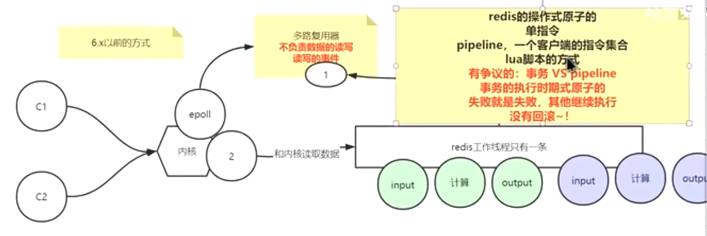
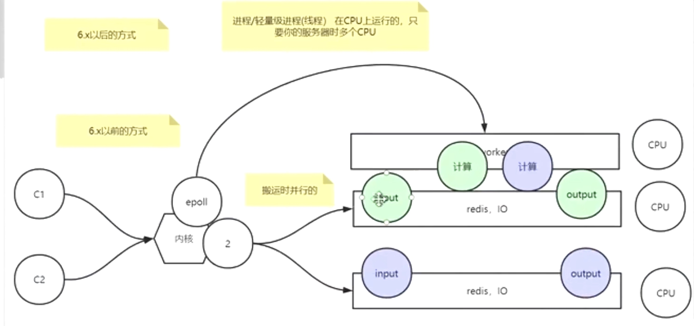
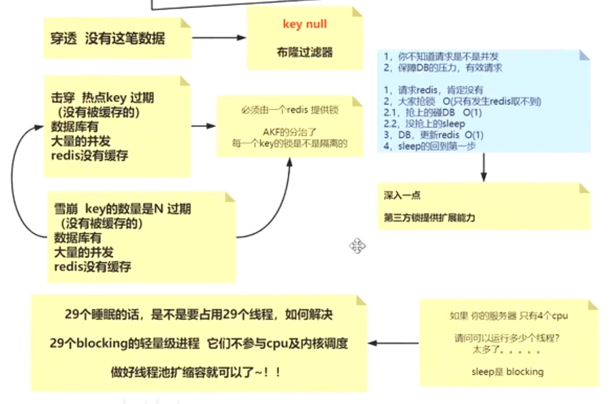
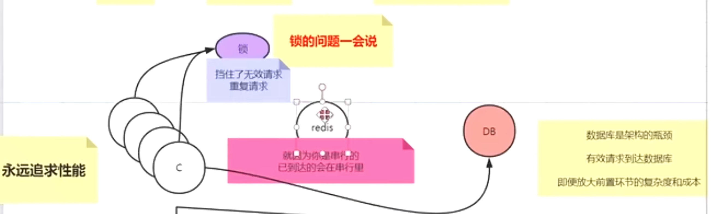

### 应用场景
1. 缓存（数据缓存、会话缓存、全页面缓存（FPC））
2. 计数器
3. 查找表
4. 消息队列（List）
5. 分布式锁

### redis是单线程还是多线程
1. 无论什么版本，工作线程就是一个
2. 6.x高版本出现了IO多线程
3. 单线程，满足redis的串行原子性，只不过IO多线程，把输入、输出放到更多的线程去并行，好处如下：执行时间缩短，更快；

#### 6.x之前的方式

#### 6.x之后的方式

### Redis单线程为什么这么快？
1. 纯内存操作
2. 核心是基于非阻塞的IO多路复用机制
3. 单线程避免了多线程的频繁上下文切换带来的性能问题。

### Redis存在线程安全的问题吗？ 为什么
redis可以保障内部串行
外界使用的时候要保障，业务上要自行保障顺序~

### 缓存穿透、缓存击穿、缓存雪崩

#### 缓存穿透
**描述：**
> 缓存穿透是指缓存和数据库中都没有的数据，而用户不断发起请求。由于缓存是不命中时被动写的，并且出于容错考虑，如果从存储层查不到数据则不写入缓存，这将导致这个不存在的数据每次请求都要到存储层去查询，失去了缓存的意义。

在流量大时，可能DB就挂掉了，要是有人利用不存在的key频繁攻击我们的应用，这就是漏洞。

如发起为id为“-1”的数据或id为特别大不存在的数据。这时的用户很可能是攻击者，攻击会导致数据库压力过大。
**解决方案**
**接口层增加校验**，如用户鉴权校验，id做基础校验，id<=0的直接拦截；
1. 从缓存取不到的数据，在数据库中也没有取到，这时也可以将key-value对写为key-null，缓存有效时间可以设置短点，如30秒（设置太长会导致正常情况也没法使用）。这样可以防止攻击用户反复用同一个id暴力攻击
2. 布隆过滤器。bloomfilter就类似于一个hash set，用于快速判某个元素是否存在于集合中，其典型的应用场景就是快速判断一个key是否存在于某容器，不存在就直接返回。布隆过滤器的关键就在于hash算法和容器大小，
3. 加互斥锁

#### 缓存击穿
**描述：**
> 缓存击穿是指缓存中没有但数据库中有的数据（一般是缓存时间到期），这时由于并发用户特别多，同时读缓存没读到数据，又同时去数据库去取数据，引起数据库压力瞬间增大，造成过大压力。
##### 特点：
1. 热点key过期
2. 数据库里有大量的并发
3. redis没有缓存

**解决方案**
1. 设置热点数据永远不过期。
2. 接口限流与熔断，降级。重要的接口一定要做好限流策略，防止用户恶意刷接口，同时要降级准备，当接口中的某些 服务  不可用时候，进行熔断，失败快速返回机制。
3. 加互斥锁

#### 缓存雪崩
**描述：**
> 缓存雪崩是指缓存中数据大批量到过期时间，而查询数据量巨大，引起数据库压力过大甚至down机。和缓存击穿不同的是，        缓存击穿指并发查同一条数据，缓存雪崩是不同数据都过期了，很多数据都查不到从而查数据库。

**解决方案：**
1. 缓存数据的过期时间设置随机，防止同一时间大量数据过期现象发生。
2. 如果缓存数据库是分布式部署，将热点数据均匀分布在不同搞得缓存数据库中。
3. 设置热点数据永远不过期。

#### Redis中connect与pconnect区别？
1.首先先介绍下connect和pconnect的区别。
connect：脚本结束之后连接就释放了。

2.pconnect：脚本结束之后连接不释放，连接保持在php-fpm进程中。
所以使用pconnect代替connect，可以减少频繁建立redis连接的消耗。

### 缓存如何回收的
1. 后台在轮询，分段分批的删除哪些过期的key
2. 请求的时候判断时候已经过期了
尽量的把内存无用的空间回收回来

### 缓存是如何淘汰的
1. 内存空间不足的情况下会进行淘汰
2. 淘汰机制里有不允许淘汰的
3. lru
4. 设置过过期的key的集合中

### 如何进行缓存预热
1. 提前把数据塞入redis，你知道哪些是热数据吗？
2. 开发逻辑上也要规避差集，否则会造成击穿、穿透、雪崩（实时加锁）

### 数据库与缓存不一致如何解决
1. 分布式事务进行解决
2. redis是缓存，更倾向于稍微的有时差
3. 减少对DB的操作（一般是读）
4. 终极方案 通过canal监听binlog，异步更新缓存。

### 简述redis的主从不一致的问题
1. redis的确默认是弱一致性
2. 锁不能用主从

### redis持久化方式
1. RDB，AOF：主从同步也算持久化
2. 高版本：开启AOF，AOF是通过执行日志得到全部内存数据的方式，但是追求性能
    1. 体积变大，重复无效的指令 重写，后台用线程把内存中的kv生成指令写入新的aof
    2. 把重写的方式换成直接RDB放到aof文件的头部

### 分布式锁
#### 基于Redis的实现方式
**1、选用Redis实现分布式锁原因：**
1. Redis有很高的性能； 
2. Redis命令对此支持较好，实现起来比较方便

**2、使用命令介绍：**
1. SETNX
2. EXPIRE
3. DELETE
在使用Redis实现分布式锁的时候，主要就会使用到这三个命令。

**3、实现思想：**
1. 获取锁的时候，使用setnx加锁，并使用expire命令为锁添加一个超时时间，超过该时间则自动释放锁，锁的value值为一个随机生成的UUID，通过此在释放锁的时候进行判断。
2. 获取锁的时候还设置一个获取的超时时间，若超过这个时间则放弃获取锁。
3. 释放锁的时候，通过UUID判断是不是该锁，若是该锁，则执行delete进行锁释放