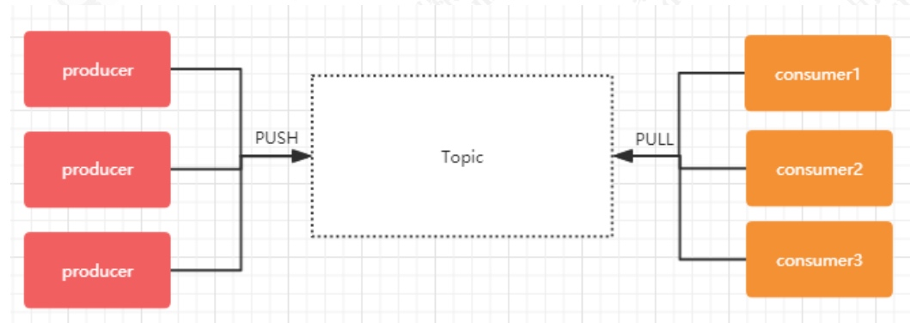
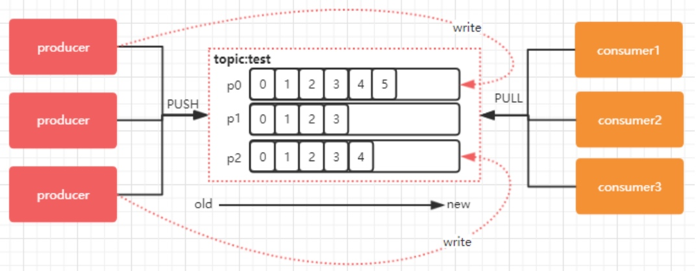
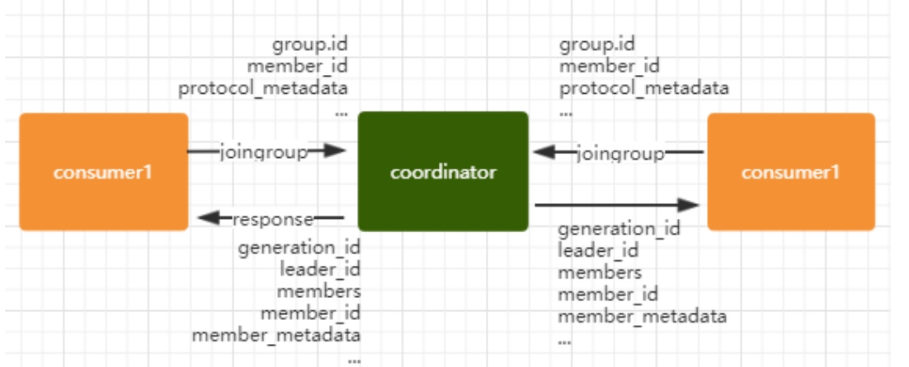
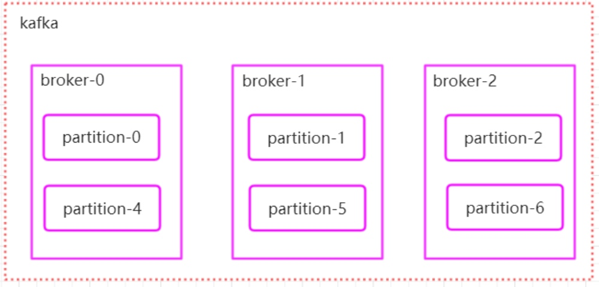

# Kafka
### Topic和Partition
#### Topic
在 kafka 中，topic 是一个存储消息的逻辑概念，可以认为是一个消息集合。每条消息发送到 kafka 集群的消息都有一个类别。物理上来说，不同的 topic 的消息是分开存储的，每个 topic 可以有多个生产者向它发送消息，也可以有多个消费者去消费其中的消息。

#### Partition：
每个 topic 可以划分多个分区（每个 Topic 至少有一个分区），同一 topic 下的不同分区包含的消息是不同的。每个消息在被添加到分区时，都会被分配一个 offset（称之为偏移量），它是消息在此分区中的唯一编号，kafka 通过 offset保证消息在分区内的顺序，offset 的顺序不跨分区，即 kafka只保证在同一个分区内的消息是有序的。下图中，对于名字为 test 的 topic，做了 3 个分区，分别是p0、p1、p2.

➢ 每一条消息发送到 broker 时，会根据 partition 的规则选择存储到哪一个 partition。如果 partition 规则设置合理，那么所有的消息会均匀的分布在不同的partition中，这样就有点类似数据库的分库分表的概念，把数据做了分片处理。

#### kafka 消息分发策略：
　　消息是 kafka 中最基本的数据单元，在 kafka 中，一条消息由 key、value 两部分构成，在发送一条消息时，我们可以指定这个 key，那么 producer 会根据 key 和 partition 机制来判断当前这条消息应该发送并存储到哪个 partition 中。我们可以根据需要进行扩展 producer 的 partition 机制
　　
#### 消息默认的分发机制：
　　默认情况下，kafka 采用的是 hash 取模的分区算法。如果Key 为 null，则会随机分配一个分区。这个随机是在这个参数”metadata.max.age.ms”的时间范围内随机选择一个。对于这个时间段内，如果 key 为 null，则只会发送到唯一的分区。这个值在默认情况下是 10 分钟更新一次。关 于 Metadata ，简单理解就是Topic/Partition 和 broker 的映射关系，每一个 topic 的每一个 partition，需要知道对应的 broker 列表是什么，leader是谁、follower 是谁。这些信息都是存储在 Metadata 这个类里面。
　　
#### 谁来执行 Rebalance 以及管理 consumer 的 group 呢？
Kafka 提供了一个角色：coordinator(协调员) 来执行对于 consumer group 的管理，当 consumer group 的第一个 consumer 启动的时候，它会去和 kafka server(broker) 确定谁是它们组的 coordinator。之后该 group 内的所有成员都会和该 coordinator 进行协调通信。consumer group 如何确定自己的 coordinator 是谁呢？ 消费 者 向 kafka 集 群 中 的 任 意 一 个 broker 发 送 一 个GroupCoordinatorRequest 请求，服务端会返回一个负载最小的 broker 节 点 的 id ， 并 将 该 broker 设 置 为coordinator。在 rebalance 之前，需要保证 coordinator 是已经确定好了的，整个 rebalance 的过程分为两个步骤 ，一个是JoinGroup 的过程，在这个过程之后会进入一个Synchronizing Group State 阶段。那么这两个阶段都做了什么呢？

**JoinGroup 的过程：**
　　表示加入到 consumer group 中，在这一步中，所有的成员都会向 coordinator 发送 joinGroup 的请求。一旦所有成员都发送了 joinGroup 请求，那么 coordinator 会选择一个 consumer 担任 leader 角色，并把组成员信息和订阅信息发送消费者。下图就是描述了这么一个过程，并且请求与响应中携带的一些重要的信息。

* 　protocol_metadata: 序列化后的消费者的订阅信息
*  leader_id： 消费组中的消费者，coordinator 会选择一个座位 leader，对应的就是 member_id
*  member_metadata 对应消费者的订阅信息
*  members：consumer group 中全部的消费者的订阅信息
*  generation_id：年代信息，类似于 zookeeper 的时候的 epoch 是一样的，对于每一轮 rebalance ，generation_id 都会递增。主要用来保护 consumer group。隔离无效的 offset 提交。也就是上一轮的consumer 成员无法提交 offset 到新的 consumer group 中。

**Synchronizing Group State 阶段：**
进入了 Synchronizing Group State阶段，主要逻辑是向 GroupCoordinator 发 送SyncGroupRequest 请求，并且处理 SyncGroupResponse响应，简单来说，就是 leader 将消费者对应的 partition 分配方案同步给 consumer group 中的所有 consumer，每个消费者都会向 coordinator 发送 syncgroup 请求，不过只有 leader 节点会发送分配方案，其他消费者只是打打酱油而已。当 leader 把方案发给 coordinator 以后，coordinator 会把结果设置到 SyncGroupResponse 中。这样所有成员都知道自己应该消费哪个分区。

#### 消息的存储：
首先我们需要了解的是，kafka 是使用日志文件的方式来保存生产者和发送者的消息，每条消息都有一个 offset 值来表示它在分区中的偏移量。Kafka 中存储的一般都是海量的消息数据，为了避免日志文件过大，Log 并不是直接对应在一个磁盘上的日志文件，而是对应磁盘上的一个目录，这个目录的命名规则是<topic_name>_<partition_id>比如创建一个名为 firstTopic 的 topic，其中有 3 个 partition，那么在 kafka 的数据目录（/tmp/kafka-log，这里可以通过server.properties中的log.dirs=/tmp/kafka-logs去修改）中就有 3 个目录，firstTopic-0~3多个分区在集群中的分配 如果我们对于一个 topic，在集群中创建多个 partition，那么 partition 是如何分布的呢？

1.将所有 N Broker 和待分配的 i 个 Partition 排序
2.将第 i 个 Partition 分配到第(i mod n)个 Broker 上

#### 幂等性:
　　所谓的幂等，简单说就是对接口的多次调用所产生的结果和调用一次是一致的。在0.11.0.0版本引入了创建幂等性Producer的功能。仅需要设置props.put(“enable.idempotence”，true)，或props.put(ProducerConfig.ENABLE_IDEMPOTENCE_CONFIG,true)。enable.idempotence设置成true后，Producer自动升级成幂等性Producer。Kafka会自动去重。Broker会多保存一些字段。当Producer发送了相同字段值的消息后，Broker能够自动知晓这些消息已经重复了。作用范围：

只能保证单分区上的幂等性，即一个幂等性Producer能够保证某个主题的一个分区上不出现重复消息。
只能实现单回话上的幂等性，这里的会话指的是Producer进程的一次运行。当重启了Producer进程之后，幂等性不保证。