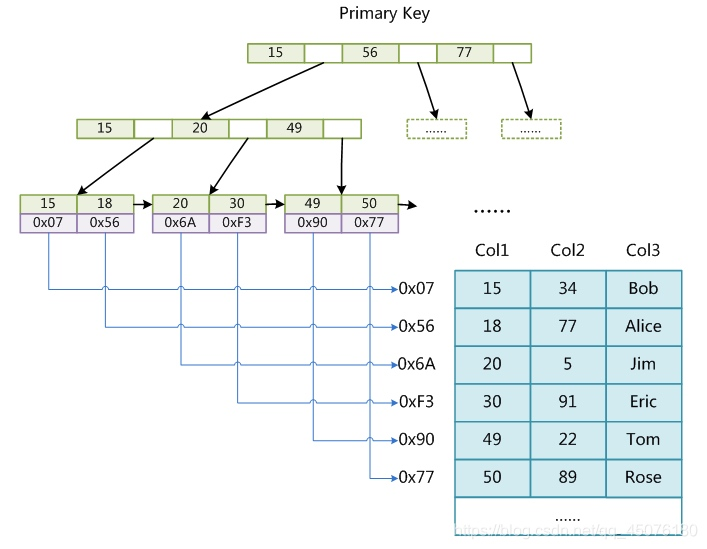
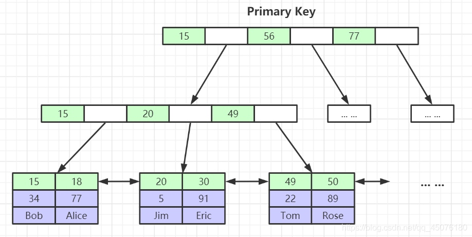
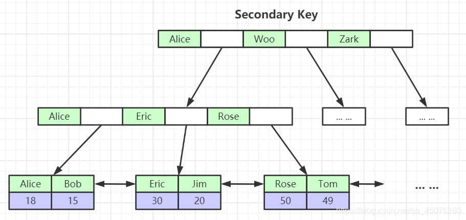

# 数据库
### Mysql 四大特性(ACID)
#### 原子性
事务必须是原子工作单元；对于其数据修改，要么全都执行，要么全都不执行。通常，与某个事务关联的操作具有共同的目标，并且是相互依赖的。如果系统只执行这些操作的一个子集，则可能会破坏事务的总体目标。原子性消除了系统处理操作子集的可能性。

#### 一致性
事务在完成时，必须使所有的数据都保持一致状态。在相关数据库中，所有规则都必须应用于事务的修改，以保持所有数据的完整性。事务结束时，所有的内部数据结构（如 B 树索引或双向链表）都必须是正确的。某些维护一致性的责任由应用程序开发人员承担，他们必须确保应用程序已强制所有已知的完整性约束。例如，当开发用于转帐的应用程序时，应避免在转帐过程中任意移动小数点。

#### 隔离性 
由并发事务所作的修改必须与任何其它并发事务所作的修改隔离。事务查看数据时数据所处的状态，要么是另一并发事务修改它之前的状态，要么是另一事务修改它之后的状态，事务不会查看中间状态的数据。这称为可串行性，因为它能够重新装载起始数据，并且重播一系列事务，以使数据结束时的状态与原始事务执行的状态相同。当事务可序列化时将获得最高的隔离级别。在此级别上，从一组可并行执行的事务获得的结果与通过连续运行每个事务所获得的结果相同。由于高度隔离会限制可并行执行的事务数，所以一些应用程序降低隔离级别以换取更大的吞吐量。

#### 持久性 
事务完成之后，它对于系统的影响是永久性的。该修改即使出现致命的系统故障也将一直保持。 

### 隔离级别
#### Read Uncommitted（读取未提交内容）
 在该隔离级别，所有事务都可以看到其他未提交事务的执行结果。本隔离级别很少用于实际应用，因为它的性能也不比其他级别好多少。读取未提交的数据，也被称之为脏读（Dirty Read）。
#### Read Committed（读取提交内容）
这是大多数数据库系统的默认隔离级别（但不是MySQL默认的）。它满足了隔离的简单定义：一个事务只能看见已经提交事务所做的改变。这种隔离级别 也支持所谓的不可重复读（Nonrepeatable Read），因为同一事务的其他实例在该实例处理其间可能会有新的commit，所以同一select可能返回不同结果。

#### Repeatable Read（可重读）
这是MySQL的默认事务隔离级别，它确保同一事务的多个实例在并发读取数据时，会看到同样的数据行。不过理论上，这会导致另一个棘手的问题：幻读 （Phantom Read）。简单的说，幻读指当用户读取某一范围的数据行时，另一个事务又在该范围内插入了新行，当用户再读取该范围的数据行时，会发现有新的“幻影” 行。InnoDB和Falcon存储引擎通过多版本并发控制（MVCC，Multiversion Concurrency Control）机制解决了该问题。
#### Serializable（可串行化） 
这是最高的隔离级别，它通过强制事务排序，使之不可能相互冲突，从而解决幻读问题。简言之，它是在每个读的数据行上加上共享锁。在这个级别，可能导致大量的超时现象和锁竞争。

**这四种隔离级别采取不同的锁类型来实现，若读取的是同一个数据的话，就容易发生问题。例如**：
* 脏读(Drity Read)：某个事务已更新一份数据，另一个事务在此时读取了同一份数据，由于某些原因，前一个RollBack了操作，则后一个事务所读取的数据就会是不正确的。
* 不可重复读(Non-repeatable read):在一个事务的两次查询之中数据不一致，这可能是两次查询过程中间插入了一个事务更新的原有的数据。
* 幻读(Phantom Read):在一个事务的两次查询中数据笔数不一致，例如有一个事务查询了几列(Row)数据，而另一个事务却在此时插入了新的几列数据，先前的事务在接下来的查询中，就会发现有几列数据是它先前所没有的。
 
>  在MySQL中，实现了这四种隔离级别，分别有可能产生问题如下所示：
 
| 隔离级别 | 脏读 | 不可重复读 | 幻读 |
| :-: | :-: | :-: | :-: |
|Read Uncommitted（读取未提交内容） | ✔️ | ✔️|✔️  |
|Read Committed（读取提交内容）    |  ❌ | ✔️| ✔️  |
|Repeatable Read（可重读）        |  ❌ | ❌| ✔️  |
|Serializable（可串行化）         |  ❌ |  ❌|  ❌ |

### MVCC
MVCC，全称 Multi-Version Concurrency Control ，即多版本并发控制。MVCC 是一种并发控制的方法，一般在数据库管理系统中，实现对数据库的并发访问，在编程语言中实现事务内存。

地址：https://blog.csdn.net/SnailMann/article/details/94724197

什么是当前读和快照读？
* **当前读**
像 select lock in share mode (共享锁), select for update; update; insert; delete (排他锁)这些操作都是一种当前读，为什么叫当前读？就是它读取的是记录的最新版本，读取时还要保证其他并发事务不能修改当前记录，会对读取的记录进行加锁

* **快照读**
像不加锁的 select 操作就是快照读，即不加锁的非阻塞读；快照读的前提是隔离级别不是串行级别，串行级别下的快照读会退化成当前读；之所以出现快照读的情况，是基于提高并发性能的考虑，快照读的实现是基于多版本并发控制，即 MVCC ,可以认为 MVCC 是行锁的一个变种，但它在很多情况下，避免了加锁操作，降低了开销；既然是基于多版本，即快照读可能读到的并不一定是数据的最新版本，而有可能是之前的历史版本
#### MVCC 能解决什么问题，好处是？
**数据库并发场景有三种，分别为：**
* 读-读：不存在任何问题，也不需要并发控制
* 读-写：有线程安全问题，可能会造成事务隔离性问题，可能遇到脏读，幻读，不可重复读
* 写-写：有线程安全问题，可能会存在更新丢失问题，比如第一类更新丢失，第二类更新丢失

**好处**
* 在并发读写数据库时，可以做到在读操作时不用阻塞写操作，写操作也不用阻塞读操作，提高了数据库并发读写的性能
* 同时还可以解决脏读，幻读，不可重复读等事务隔离问题，但不能解决更新丢失问题

##### 小结
MVCC + 悲观锁
MVCC 解决读写冲突，悲观锁解决写写冲突
MVCC + 乐观锁
MVCC 解决读写冲突，乐观锁解决写写冲突

### 一个SQL语句的执行过程
客户端-连接器-查询缓存-分析器-优化器-执行器-存储引擎
#### 连接器

##### 长连接

###### 概念
长连接是相对于短连接来说的。长连接指在一个连接上可以连续发送多个数据包，在连接保持期间，如果有数据包发送，需要双方发送链路检测包。mysql的长连接如果长期闲置，mysql会8小时后自动断开该连接。

##### 短连接

###### 概念
是指双方有数据交互时，就建立一个连接，数据发送完成后，则断开此连接，即每次连接只完成一项业务的发送。

##### 短连接 VS 长连接

1. 建立连接的过程是复杂的，在使用中尽量减少建立连接的操作，尽量使用长连接。
2. 如果全部使用长连接，会导致Mysql内存涨的特别快，导致内存占用大，被系统强行杀掉了。

##### 如何解决长连接
1. 定期断开长连接
2. 执行一个比较大的操作后，通过执行mysql_reset_connection来初始化连接资源。这个过程不需要重新连接和权限验证。（mysql 5.7以上的版本）

#### 查询缓存
##### 查询缓存是什么
SQL文本与查询结果的映射

##### 缓存条件
1. 查询SQL语句完全相同（空格和大小写严格校验）
2. 开启查询缓存

query_cache_type 0 不使用查询缓存 1 始终使用查询缓存 2 按需使用查询缓存

1.query_cache_type值为1时，不想使用缓存中查询的数据

SELECT SQL_NO_CACHE * FROM my_table WHERE condition;

2.query_cache_type值为2，要使用缓存的话，需要使用SQL_CACHE开关参数：

SELECT SQL_CACHE * FROM my_table WHERE condition;

##### 缓存失效时机
在表结构或者数据发生改变时，查询的数据不再有效。（INSERT、UPDATE、DELETE、ALERT等）
Mysql8.0版本将查询缓存的整个模块删除。

#### 解析器
分为词法分析和语法分析
词法分析采用Lex词法分析器
Lex
Lex是Unix环境下非常著名的工具,主要功能是生成一个词法分析器(scanner)的C源码，描述规则采用正则表达式。

语法分析采用

yacc是一个典型的语法解析器。yacc生成的编译器主要是用C语言写成的语法解析器（Parser），需要与词法解析器Lex一起使用，再把两部份产生出来的C程序一并编译。

select id, name from table1 where id=1

语句被解析为
1. sql_command = SQLCOM_SELECT
2. where子句 :select_lex->where
3. table列表：select_lex->table_list
4. 字段列表：select_lex->item_list

1. table_list 保存表名
2. where 
 where
     |-->FUNC_ITEM
         |-->FIELD_ITEM("id")
         |-->INT_ITEM(1)
3. item_list

   item_list:
     |-->Item_field("id")
     |-->Item_field("name")

#### 优化器

##### 优化步骤
1. 根据语法树及统计统计，构建初始表访问数组（init_plan_arrays）
2. 根据表访问数组，计算每个表的最佳访问路径(find_best_ref)，同时保存当前最优执行计划（COST最小）
3. 如果找到更优的执行计划则更新最优执行计划，否则优化结束。

##### 举例
select * from table1 join table2 using（id） where table1.c = 10 and table2.d = 20;

两种方案 
1. 从表1里面取出c=10的记录的ID值，再根据ID值关联到t2，再判断t2里面的d值是否等于20。
2. 也可以先从表2中取出记录d=20的ID值，再根据ID值关联到t1，在判断t1的c值是否等于10。

### InnoDB与MyISAM区别
地址：https://blog.csdn.net/qq_45076180/article/details/115111803
#### MyISAM存储引擎
MyISAM无论是主键索引还是非主键索引都是非聚集索引（叶子节点不包含所有数据记录）,索引文件和数据文件是分离的，跨文件查询速度比较慢。

#### InnoDB存储引擎
InnoDB的主键索引就是聚集索引（叶子节点包含了完整的数据记录，查询速度较快），聚集索引在innoDB表中只有一个。

InnoDB的非主键索引就是非聚集索引（叶子节点存储的是主键的id，用于回表查询，回表查询导致速度较慢）
非主键索引包括 二级索引、复合索引 等等

#### InnoDB与MyISAM的区别
1. InnoDB 支持事务，MyISAM 不支持。这是 MySQL 将默认存储引擎从 MyISAM 变成 InnoDB 的重要原因之一
2. InnoDB 最小的锁粒度是行锁，MyISAM 最小的锁粒度是表锁。个更新语句会锁住整张表，导致其他查询和更新都会被阻塞，因此并发访问受限
3. InnoDB 是聚集索引，MyISAM 是非聚集索引
4. InnoDB 支持外键， MyISAM 不支持
5. InnoDB 不保存表的具体行数，执行 select count(*) from table 时需要全表扫描。而MyISAM 用一个变量保存了整个表的行数，执行上述语句时只需要读出该变量即可，速度很快

### 聚簇索引和非聚簇索引
1. 非聚簇索引
    * [ ] Myisam 索引与数据的关系
    * [ ] Myisam 索引指向行所在磁盘的位置
    * [ ] 数据都有自己的地址
    * [ ] 数据和索引相互独立
2. 聚簇索引
    * [ ] 主键索引 既存索引值，又在叶子中存储行的数据
    * [ ] 如果没有主键（primary key），则会Unique key做主键
    * [ ] 如果没有unique，则系统生成一个内部的rowid做主键
    * [ ] 像innodb中，主键的索引结构中既存储了主键值，又存储了行数据的这样的结构c称为“聚簇索引”   
3. 聚簇索引和非聚簇索引的优缺点

    优势：根据主键查询条目比较少，不用回行(数据就在主键节点下)
    劣势: 如果碰到不规则数据插入时会造成频繁的页分裂。
####索引覆盖
索引覆盖是指查询的列恰好是索引的一部分，那么查询只需要在索引文件上进行，不需要回行到磁盘在查找数据，这样查询速度非常快

#### 理想的索引
1. 查询频繁
2. 区分度高
3. 长度小
4. 尽可能覆盖常用字段

### Mysql建表、列选择注意点
#### 建表原则
1. 定长与变长相分离
2. 常用字段和不常用字段要分离
3. 1对多，需要关联统计的字段上，添加冗余字段(空间和时间上的转换)
 
#### 列选择原则
1. 字段类型优先级 整形 > date,time > enum,char > varchar > blob,text
> time 定长,运算快，节省空间,考虑时区，写sql时不方便 where > '2005-10-12';
> enum 能起到约束值的目的，内部用整形来存储
> char 定长 需要考虑字符集和(排序校对集)
> varchar 不定长 要考虑字符集的转换与排序时校对集，速度慢
> text/Blob 无法使用内存临时表（排序等操作只能在磁盘上进行）

2. 够用就行，不要慷慨
> 原因：大的字段浪费内存，影响速度
> 以年龄为例，tinyint unsigned not null 可以存储255岁,足够使用 ,用int浪费了3个字节
> 以varchar(10) 和 varchar(300) 存储的内容相同，但是在表的联查上varchar(300)要花费更多的内存。

3. 尽量避免使用NULL
> 原因：NULL 不利于索引 要用特殊字节来标注

