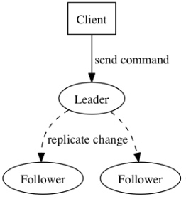
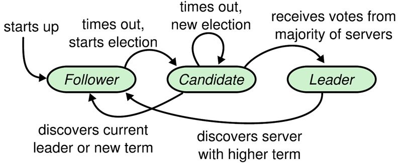
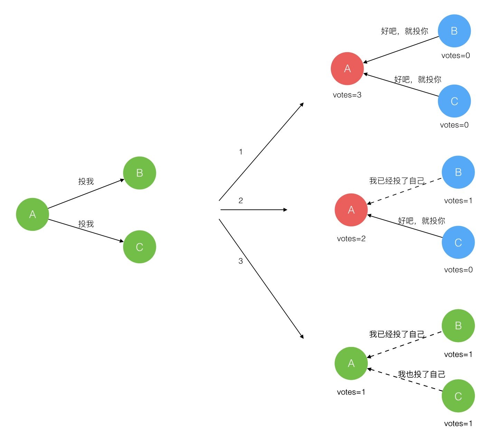
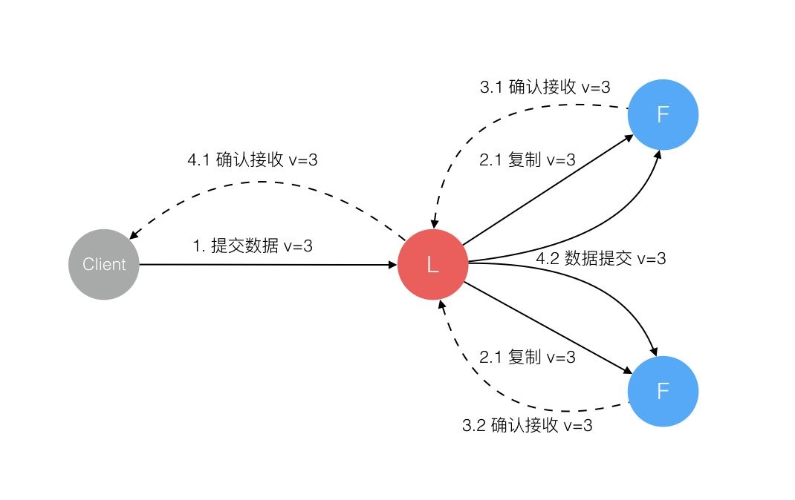
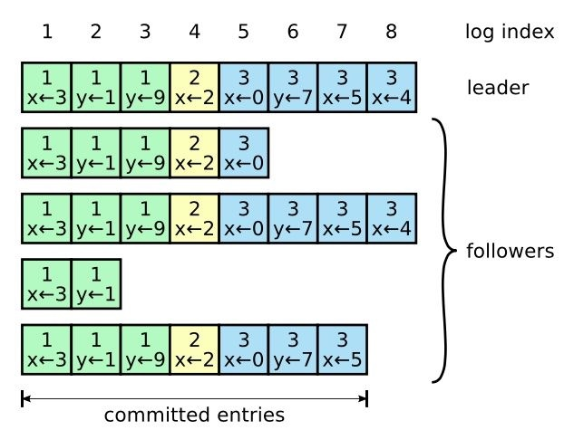

# 架构
### 分布式系统CAP理论
#### 概念
一个分布式系统最多只能同时满足一致性（Consistency）、可用性（Availability）和分区容错性（Partition tolerance）这三项中的两项
#### 定义
**Consistency 一致性**

一致性是因为多个数据拷贝下并发读写才有的问题，因此理解时一定要注意结合考虑多个数据拷贝下并发读写的场景。

**Availability 可用性**
可用性指“Reads and writes always succeed”，即服务在正常响应时间内一直可用。
好的可用性主要是指系统能够很好的为用户服务，不出现用户操作失败或者访问超时等用户体验不好的情况。可用性通常情况下可用性和分布式数据冗余，负载均衡等有着很大的关联。

**Partition Tolerance分区容错性**
分区容错性指“the system continues to operate despite arbitrary message loss or failure of part of the system”，即分布式系统在遇到某节点或网络分区故障的时候，仍然能够对外提供满足一致性或可用性的服务。

#### CAP权衡
1. CA without P：如果不要求P（不允许分区），则C（强一致性）和A（可用性）是可以保证的。但其实分区不是你想不想的问题，而是始终会存在，因此CA的系统更多的是允许分区后各子系统依然保持CA。
2. CP without A：如果不要求A（可用），相当于每个请求都需要在Server之间强一致，而P（分区）会导致同步时间无限延长，如此CP也是可以保证的。很多传统的数据库分布式事务都属于这种模式。
3. AP wihtout C：要高可用并允许分区，则需放弃一致性。一旦分区发生，节点之间可能会失去联系，为了高可用，每个节点只能用本地数据提供服务，而这样会导致全局数据的不一致性。现在众多的NoSQL都属于此类。

### Raft算法详解
#### Raft算法概述
将一致性分解为多个子问题：Leader选举（Leader election）、日志同步（Log replication）、安全性（Safety）、日志压缩（Log compaction）、成员变更（Membership change。
Raft将系统中的角色分为领导者（Leader）、跟从者（Follower）和候选人（Candidate）：

**Leader：**接受客户端请求，并向Follower同步请求日志，当日志同步到大多数节点上后告诉Follower提交日志。
**Follower：**接受并持久化Leader同步的日志，在Leader告之日志可以提交之后，提交日志。
**Candidate：**Leader选举过程中的临时角色。

Raft要求系统在任意时刻最多只有一个Leader，正常工作期间只有Leader和Followers。

Raft算法角色状态转换如下

#### Leader选举
Raft 使用心跳（heartbeat）触发Leader选举。当服务器启动时，初始化为Follower。Leader向所有Followers周期性发送heartbeat。如果Follower在选举超时时间内没有收到Leader的heartbeat，就会等待一段随机的时间后发起一次Leader选举。
Follower将其当前term加一然后转换为Candidate。它首先给自己投票并且给集群中的其他服务器发送 RequestVote RPC （RPC细节参见八、Raft算法总结）。结果有以下三种情况：

* 赢得了多数的选票，成功选举为Leader；
* 收到了Leader的消息，表示有其它服务器已经抢先当选了Leader；
* 没有服务器赢得多数的选票，Leader选举失败，等待选举时间超时后发起下一次选举。

#### 日志同步
Leader选出后，就开始接收客户端的请求。Leader把请求作为日志条目（Log entries）加入到它的日志中，然后并行的向其他服务器发起 AppendEntries RPC （RPC细节参见八、Raft算法总结）复制日志条目。当这条日志被复制到大多数服务器上，Leader将这条日志应用到它的状态机并向客户端返回执行结果。

某些Followers可能没有成功的复制日志，Leader会无限的重试 AppendEntries RPC直到所有的Followers最终存储了所有的日志条目。

日志由有序编号（log index）的日志条目组成。每个日志条目包含它被创建时的任期号（term），和用于状态机执行的命令。如果一个日志条目被复制到大多数服务器上，就被认为可以提交（commit）了。

### 分布式锁
#### 基于Redis的实现方式
**1、选用Redis实现分布式锁原因：**
1. Redis有很高的性能； 
2. Redis命令对此支持较好，实现起来比较方便

**2、使用命令介绍：**
1. SETNX
2. EXPIRE
3. DELETE
在使用Redis实现分布式锁的时候，主要就会使用到这三个命令。

**3、实现思想：**
1. 获取锁的时候，使用setnx加锁，并使用expire命令为锁添加一个超时时间，超过该时间则自动释放锁，锁的value值为一个随机生成的UUID，通过此在释放锁的时候进行判断。
2. 获取锁的时候还设置一个获取的超时时间，若超过这个时间则放弃获取锁。
3. 释放锁的时候，通过UUID判断是不是该锁，若是该锁，则执行delete进行锁释放

#### 基于数据库的实现方式
**基于数据库的实现方式的核心思想是**：
在数据库中创建一个表，表中包含方法名等字段，并在方法名字段上创建唯一索引，想要执行某个方法，就使用这个方法名向表中插入数据，成功插入则获取锁，执行完成后删除对应的行数据释放锁。
使用基于数据库的这种实现方式很简单，但是对于分布式锁应该具备的条件来说，它有一些问题需要解决及优化：
1. 因为是基于数据库实现的，数据库的可用性和性能将直接影响分布式锁的可用性及性能，所以，数据库需要双机部署、数据同步、主备切换；
2. 不具备可重入的特性，因为同一个线程在释放锁之前，行数据一直存在，无法再次成功插入数据，所以，需要在表中新增一列，用于记录当前获取到锁的机器和线程信息，在再次获取锁的时候，先查询表中机器和线程信息是否和当前机器和线程相同，若相同则直接获取锁；
3. 没有锁失效机制，因为有可能出现成功插入数据后，服务器宕机了，对应的数据没有被删除，当服务恢复后一直获取不到锁，所以，需要在表中新增一列，用于记录失效时间，并且需要有定时任务清除这些失效的数据；
4. 不具备阻塞锁特性，获取不到锁直接返回失败，所以需要优化获取逻辑，循环多次去获取。
5. 在实施的过程中会遇到各种不同的问题，为了解决这些问题，实现方式将会越来越复杂；依赖数据库需要一定的资源开销，性能问题需要考虑。

#### 基于ZooKeeper的实现方式
ZooKeeper是一个为分布式应用提供一致性服务的开源组件，它内部是一个分层的文件系统目录树结构，规定同一个目录下只能有一个唯一文件名。基于ZooKeeper实现分布式锁的步骤如下：

1. 创建一个目录mylock； 
2. 线程A想获取锁就在mylock目录下创建临时顺序节点； 
3. 获取mylock目录下所有的子节点，然后获取比自己小的兄弟节点，如果不存在，则说明当前线程顺序号最小，获得锁； 
4. 线程B获取所有节点，判断自己不是最小节点，设置监听比自己次小的节点； 
5. 线程A处理完，删除自己的节点，线程B监听到变更事件，判断自己是不是最小的节点，如果是则获得锁。

> 优点：具备高可用、可重入、阻塞锁特性，可解决失效死锁问题。
> 缺点：因为需要频繁的创建和删除节点，性能上不如Redis方式。

### 高并发下接口幂等性解决方案
#### 概念
在编程中.一个幂等操作的特点是其任意多次执行所产生的影响均与一次执行的影响相同。幂等函数，或幂等方法，是指可以使用相同参数重复执行，并能获得相同结果的函数。这些函数不会影响系统状态，也不用担心重复执行会对系统造成改变。例如，“getUsername()和setTrue()”函数就是一个幂等函数. 更复杂的操作幂等保证是利用唯一交易号(流水号)实现.

#### 幂等性场景
1. 查询操作：查询一次和查询多次，在数据不变的情况下，查询结果是一样的。select是天然的幂等操作；
2. 删除操作：删除操作也是幂等的，删除一次和多次删除都是把数据删除。(注意可能返回结果不一样，删除的数据不存在，返回0，删除的数据多条，返回结果多个) ；
3. 唯一索引：防止新增脏数据。比如：支付宝的资金账户，支付宝也有用户账户，每个用户只能有一个资金账户，怎么防止给用户创建资金账户多个，那么给资金账户表中的用户ID加唯一索引，所以一个用户新增成功一个资金账户记录。要点：唯一索引或唯一组合索引来防止新增数据存在脏数据（当表存在唯一索引，并发时新增报错时，再查询一次就可以了，数据应该已经存在了，返回结果即可）；

4. token机制：防止页面重复提交。
    1. 原理上通过session token来实现的(也可以通过redis来实现)。当客户端请求页面时，服务器会生成一个随机数Token，并且将Token放置到session当中，然后将Token发给客户端（一般通过构造hidden表单）。
    2. 下次客户端提交请求时，Token会随着表单一起提交到服务器端。
    3. 服务器端第一次验证相同过后，会将session中的Token值更新下，若用户重复提交，第二次的验证判断将失败，因为用户提交的表单中的Token没变，但服务器端session中Token已经改变了。

5. 悲观锁
    1. 获取数据的时候加锁获取。select * from table_xxx where id='xxx' for update; 注意：id字段一定是主键或者唯一索引，不然是锁表，会死人的；悲观锁使用时一般伴随事务一起使用，数据锁定时间可能会很长，根据实际情况选用；

6. 乐观锁——乐观锁只是在更新数据那一刻锁表，其他时间不锁表，所以相对于悲观锁，效率更高。乐观锁的实现方式多种多样可以通过version或者其他状态条件：
    1. 通过版本号实现update table_xxx set name=#name#,version=version+1 where version=#version#如下图(来自网上)；
    2. 通过条件限制 update table_xxx set avai_amount=avai_amount-#subAmount# where avai_amount-#subAmount# >= 0要求：quality-#subQuality# >= ，这个情景适合不用版本号，只更新是做数据安全校验，适合库存模型，扣份额和回滚份额，性能更高；

7. 分布式锁
    1. 如果是分布是系统，构建全局唯一索引比较困难，例如唯一性的字段没法确定，这时候可以引入分布式锁，通过第三方的系统(redis或zookeeper)，在业务系统插入数据或者更新数据，获取分布式锁，然后做操作，之后释放锁，这样其实是把多线程并发的锁的思路，引入多多个系统，也就是分布式系统中得解决思路。要点：某个长流程处理过程要求不能并发执行，可以在流程执行之前根据某个标志(用户ID+后缀等)获取分布式锁，其他流程执行时获取锁就会失败，也就是同一时间该流程只能有一个能执行成功，执行完成后，释放分布式锁(分布式锁要第三方系统提供)；
8. select + insert
    1. 并发不高的后台系统，或者一些任务JOB，为了支持幂等，支持重复执行，简单的处理方法是，先查询下一些关键数据，判断是否已经执行过，在进行业务处理，就可以了。注意：核心高并发流程不要用这种方法；

9. 状态机幂等
    1. 在设计单据相关的业务，或者是任务相关的业务，肯定会涉及到状态机(状态变更图)，就是业务单据上面有个状态，状态在不同的情况下会发生变更，一般情况下存在有限状态机，这时候，如果状态机已经处于下一个状态，这时候来了一个上一个状态的变更，理论上是不能够变更的，这样的话，保证了有限状态机的幂等。注意：订单等单据类业务，存在很长的状态流转，一定要深刻理解状态机，对业务系统设计能力提高有很大帮助

10. 对外提供接口的api如何保证幂等
    1. 如银联提供的付款接口：需要接入商户提交付款请求时附带：source来源，seq序列号；source+seq在数据库里面做唯一索引，防止多次付款(并发时，只能处理一个请求) 。
    2. 重点：对外提供接口为了支持幂等调用，接口有两个字段必须传，一个是来源source，一个是来源方序列号seq，这个两个字段在提供方系统里面做联合唯一索引，这样当第三方调用时，先在本方系统里面查询一下，是否已经处理过，返回相应处理结果；没有处理过，进行相应处理，返回结果。注意，为了幂等友好，一定要先查询一下，是否处理过该笔业务，不查询直接插入业务系统，会报错，但实际已经处理了。

    