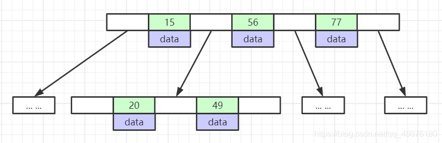
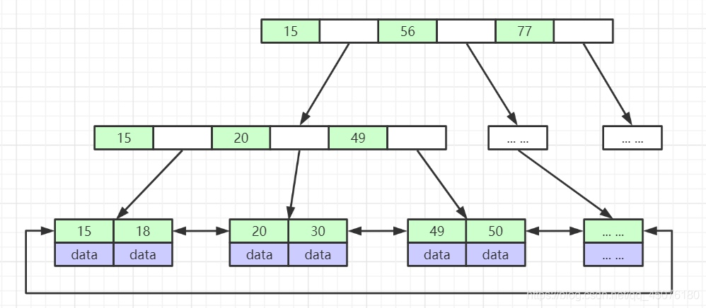

# 算法
## 树
### 二叉树 
L、D、R分别表示遍历左子树、访问根结点和遍历右子树
* 先序遍历：DLR
* 中序遍历：LDR
* 后序遍历：LRD

> 仅有前序和后序遍历，不能确定一个二叉树，必须有中序遍历的结果

### 二叉树的性质 
* 性质1：在二叉树中第 i 层的结点数最多为 2^i-1 （i ≥ 1）
* 性质2：高度为k的二叉树其结点总数最多为 2^k －1 （k ≥ 1）
* 性质3：对任意的非空二叉树 T ，如果叶结点的个数为n<sub>0</sub>，而其度为 2 的结点数为 n<sub>2</sub>，则： n<sub>0</sub> = n<sub>2</sub> + 1

### 满二叉树
深度为k，且有 2^k -1  个节点称之为 满二叉树；

* 性质4：第i层上的节点数为 2^i -1 ；


### 完全二叉树
深度为k，有n个节点的二叉树，当且仅当其每一个节点都与深度为k的满二叉树中，序号为1至n的节点对应时，称之为完全二叉树。

* 性质5：对于具有n个结点的完全二叉树的高度为 log<sub>2</sub>^n +1：

### 平衡二叉树
### B-Tree
红黑树每个节点上只存一个数据，导致大数据量时高度太高，B-Tree为了优化数的高度，如图所示：每一层树高上存储多个节点，节点中的数据索引从左到右递增排列，这样每个节点区间（数据页）内又可以向下延伸新的节点区间（数据页）。这样每一层都可以放更多的索引元素，有效的降低了树的高度，B-Tree具有以下特点：


* 节点中的数据索引从左到右递增排列
* 所有索引节点上都存储数据，所有索引节点不重复

### B+Tree

B+Tree 作为 B-Tree的变种，有以下特点
* 非叶子节点不存储data，只存储索引(冗余)，可以放更多的索引
* 叶子节点包含所有索引字段
* 节点中的数据索引从左到右递增排列，叶子节点用指针连接，提高区间访问的性能
* B+Tree在查询数据时，也是从上往下查询的，首先第一次磁盘IO把B+Tree的第一层数据加载到内存中，然后通过算法找到找个要查的这个数据位于第一层的哪个区间（数据页），然后再进行一次磁盘IO把这个区间加载到内存，到这个区间中去找，以此类推。。。最终可找到想要的数据！mysql正是使用了B+Tree的数据结构，才可以支撑千万级的数据。

### 二叉树（先序、中序、后序遍历）
```go
package main

import "fmt"

type Tree struct {
	No    int
	Left  *Tree
	Right *Tree
}

func PreTree(node *Tree) {
	if node != nil {
		fmt.Printf("no:%d \n", node.No)
		PreTree(node.Left)
		PreTree(node.Right)
	}
}

func InfixTree(node *Tree) {
	if node != nil {
		InfixTree(node.Left)
		fmt.Printf("no:%d \n", node.No)
		InfixTree(node.Right)
	}
}

func AfterTree(node *Tree) {
	if node != nil {
		AfterTree(node.Left)
		AfterTree(node.Right)
		fmt.Printf("no:%d \n", node.No)
	}
}

func buildTree(nums []int, l int, r int) *Tree {
	if l > r {
		return nil
	}
	mid := (l + r) >> 1
	node := &Tree{nums[mid], nil, nil}

	node.Left = buildTree(nums, l, mid-1)
	node.Right = buildTree(nums, mid+1, r)
	return node
}

func main() {
	nums := []int{1, 2, 3}
	root := buildTree(nums, 0, len(nums)-1)
	fmt.Print(root.Left.No)
	fmt.Print(root.Right.No)
	//PreTree(root)
	AfterTree(root)
}
```

### 堆 #
堆通常是一个可以被看做一棵树的数组对象。堆的实现通过构造二叉堆（binary heap），实为二叉树的一种；

* 任意节点小于（或大于）它的所有后裔，最小元（或最大元）在堆的根上（堆序性）。
* **堆总是一棵完全树**。即除了最底层，其他层的节点都被元素填满，且最底层尽可能地从左到右填入。
将根节点最大的堆叫做最大堆或大根堆，根节点最小的堆叫做最小堆或小根堆。常见的堆有二叉堆、斐波那契堆等。

通常堆是通过一维数组来实现的。在数组起始位置为1的情形中：

* 父节点i的左子节点在位置 2 ×i ;
* 父节点i的右子节点在位置 2×i+1 ;
* 子节点i的父节点在位置 i÷2 ;

### LRU缓存机制

```
package main

import "fmt"

type Node struct {
	pre  *Node
	next *Node
	key  int
	val  int
}

type lruCache struct {
	cap      int
	headNode *Node
	tailNode *Node
	nodeMap  map[int]*Node
}

func (l *lruCache) get(k int) int {
	node := l.nodeMap[k]
	if node == nil {
		return -1
	}
	headNode := l.headNode

	//将节点node的前驱结点和后继节点连接起来
	node.pre.next = node.next
	node.next.pre = node.pre

	headNode.next.pre = node
	node.next = headNode.next
	headNode.next = node
	node.pre = headNode

	v := node.val
	return v
}

func (l *lruCache) set(k, v int) {
	node := l.nodeMap[k]
	if node == nil {
		if len(l.nodeMap) == l.cap {
			lastNode := l.tailNode.pre
			lastNode.pre.next = l.tailNode
			l.tailNode.pre = lastNode.pre
			lastNode.pre = nil
			lastNode.next = nil
			deleteKey := lastNode.key
			delete(l.nodeMap, deleteKey)
		}

		newNode := &Node{
			pre:  l.headNode,
			next: l.headNode.next,
			key:  k,
			val:  v,
		}
		l.headNode.next = newNode
		l.headNode.next.pre = newNode
		l.nodeMap[k] = newNode
	} else {
		node.val = v
		//摘除node
		node.pre.next = node.next
		node.next.pre = node.pre

		l.headNode.next.pre = node
		l.headNode.next = node

		node.pre = l.headNode
		node.next = l.headNode.next
	}
}

func main() {
	head := &Node{
		pre:  nil,
		next: nil,
		key:  0,
		val:  0,
	}
	tail := &Node{
		pre:  nil,
		next: nil,
		key:  0,
		val:  0,
	}
	head.next = tail
	tail.pre = head
	lru := lruCache{
		cap:      2,
		headNode: head,
		tailNode: tail,
		nodeMap:  make(map[int]*Node),
	}
	lru.set(1, 1)
	lru.set(2, 2)
	re := lru.get(1)
	fmt.Println(re) // 1
	lru.set(3, 3)
	re = lru.get(2)
	fmt.Println(re) // -1
	re = lru.get(3)
	fmt.Println(re) // 3
	lru.set(4, 4)
	re = lru.get(1)
	fmt.Println(re) // -1
	re = lru.get(3)
	fmt.Println(re) // 3
	re = lru.get(4)
	fmt.Println(re) // 4
}

```

经典链表
https://www.cnblogs.com/huangliang-hb/p/10855558.html